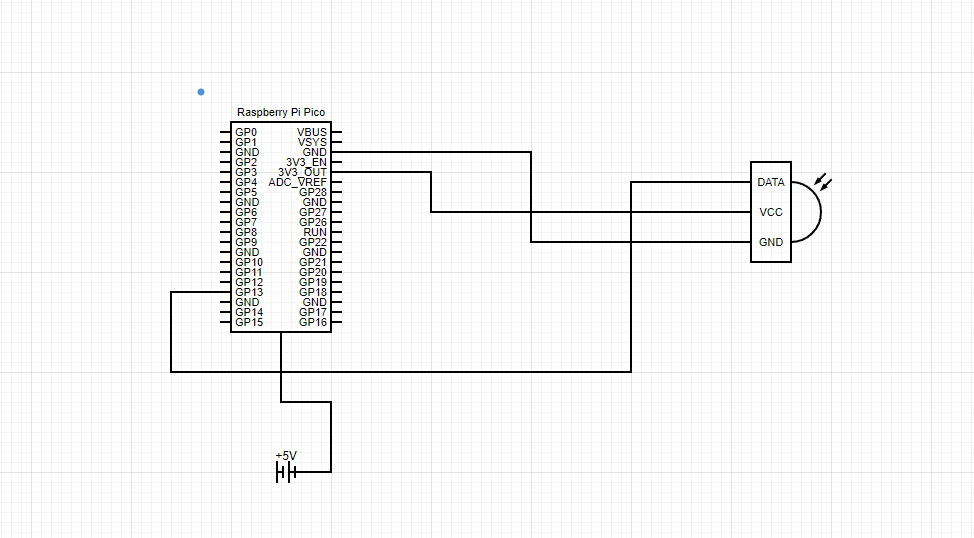
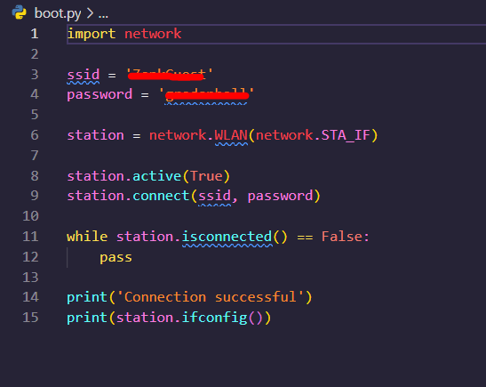
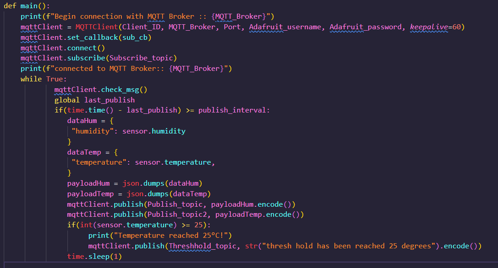
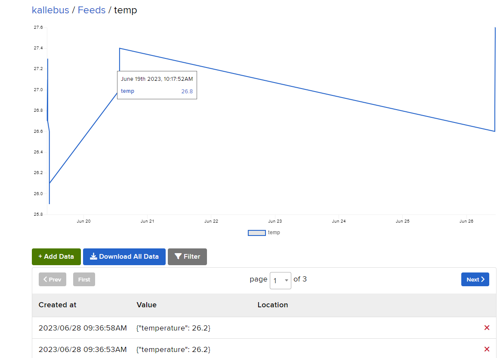
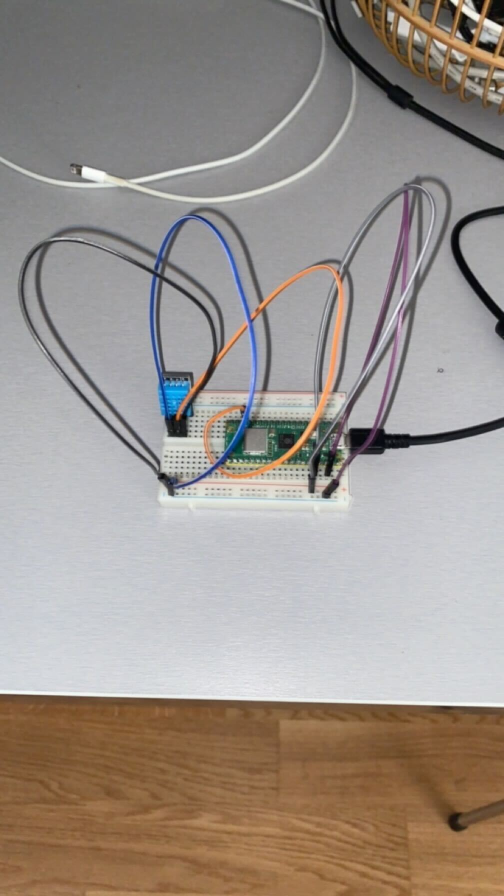

# Weather-project-IoT
IoT project with a DHT11 sensor
Pico-W-Stub that is created when you configure your project on pico is gitignored. 

Hello! my name is Kalle Andreasson (ka223ey). I have made a IoT project that sends the temperature and humidity to Adafruit from a Raspberry pico. The temperature and humidity is collected with a sensor called DHT11. I have also set a thresh hold on 25 degrees, If the temperature is above 25 degrees then I will also upload that to adafruit but in a different feed. If you are completely new to IoT this project might take a couple of weeks, this was my second project within IoT and it took me 3-4 weeks. 

## Objective
I chose this project because I already had some of the hardware at home and the project seemed to be fairly simple and fun to do, so I thought it would be a good beginner project. The purpose of my project is to read the temperature and humidity then upload it to a cloud service called Adafruit were i visualize it with graphs. It's main purpose is to tell the temperature and humidity. I've learned more about Adafruit, how to connect the hardware on a raspberry pico w and also gained more knowledge when it comes to coding in micropython. 
## Material
| Hardware  | Link |
| ------------- | ------------- |
| For my raspberry i used the raspberry pi pico w, costs 84SEK  | [Raspberry pi pico w](https://www.electrokit.com/produkt/raspberry-pi-pico-w/) |
| Standard breadboard used to connect the hardware, costs 62SEK  | [Breadboard](https://www.electrokit.com/produkt/kopplingsdack-840-anslutningar/) |
| Basic jumper cabmles with male pins, costs 50SEK  | [Jumper cables](https://www.electrokit.com/produkt/labbsladd-40-pin-30cm-hane-hane/) |
| Pin strip, costs 10SEK  | [Pin strip](https://www.electrokit.com/produkt/stiftlist-2-54mm-1x40p-brytbar/) |
| DHT11 sensor used to meassure temperature and humidity, costs 63SEK  | [DHT11 sensor](https://www.amazon.se/gp/product/B089W8DB5P/ref=ppx_yo_dt_b_asin_title_o00_s00?ie=UTF8&th=1) |
## Computer setup
The raspberry is the mind of the whole setup, it's a micro computer. The raspberry is where you write your code, my code is written in micro python. The breadboard is used to easier connect the hardware to each other with pin holes that you connect the jumper cables to. Pin strip is used to install the raspberry on the breadboard and last the sensor is used to meassure the temperature and humidity and is connected to the raspberry with jumper cables. 

I chose Visual studio code (VSC) as my IDE, I tried thonny but it was not as good as VSC. The code is uploaded to this repository and to my raspberry. I used the extension pico-w-go to upload code to my raspberry and configure the project. In the pico-w-go extension there is an option to upload the code if your raspberry is connected to your PC. If the raspberry is connected and VSC does not notice it you can chose the connect option and then it should reconnect and Visual studio code should be able to see that its connected. You have to download the corresponding UF2 file. If you hold down the boot button on your raspberry and open the provided index file you can see a bunch of UF2 files that are free to download. For my project i also had to download the dht.py and simple.py files. Feel free to downlaod them directly from my repository if you are planning on doing something similar to my project

## Putting everything together
Pretend that the Raspberry is a pi pico w and the sensor is a DHT11 sensor

See the image above for how i connected my sensor to my rasbperrry pi pico w

See the image above for pin layout of a raspberry pi pico w 

I'm using Adafruit which is a free cloud service, I upload all the data there and print out graphs and values for the temperature and the humidity. I chose Adafruit because one of my teachers had a really good tutorial on it and it felt like the easiest one since i dont have that much experience with either IoT or micropython. I'm happy that i chose Adafruit because its a easy to use platform and there's a lot of different things i can do like for an example i could toggle the led lamp on my rasbperry. And set up a dashboard with more functionalty

## The code

How i connect to my wifi (see code snippet above)

The main function of my code that upload all the values to adafruit as json to two different feeds, on efor temperature and one for humidity. And i also have a tresh hold for 25 degrees and if that is reached i upload an event to a different feed. For my libraries i just downloaded the python files directly to my repository and that would be the dht and smiple files

## Transmitting the data

The data is sent once every other second, I used wifi as my wireless protocol and MQTT as my transport protocol. With wifi the range is limited but I didnt plan to move the device around i will just have it outside on my coffee table. Either have the devicde connected to a power bank or a power outlet and both works fine if you ask me.

## Presenting the data

The data is uploaded to feeds on adafruit and visualized with graphs and all the data in a feed is saved for 30 days. I dont have a trigger for when the temperature is above 25 degrees and have reached the tresh hold, however if someone wants to continue the development of my project they can implement that since an event is uploaded to adafruit once the tresh hold has been reached.

This is how my project looks like in real life, I'm happy how my project turned out and it was fun to work with. If I would have had more time i would have done something with the tresh hold, perhaps implement so that you get a notification on your mobile phone once the tresh hold has been reached. But I had some rest assignments in other classes that I needed to work on as well.

